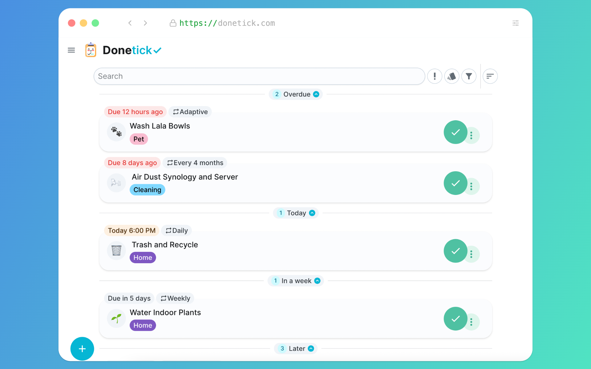

# Donetick 


**Simplify Tasks & Chores, Together!**

Donetick is an open-source, user-friendly app designed to help you organize tasks and chores effectively.featuring customizable options to help you and others stay organized




[](https://discord.gg/6hSH6F33q7)
[](https://www.reddit.com/r/donetick)

---

## ✨ Features


🏰 Group-Based Task Management: Create and manage tasks for solo or with your family or friends in shared circles.

🔄 Smart Assignments: Assign tasks to individuals with rotation strategies like random or least completed.

⏰ Recurring Tasks: Automate task scheduling with flexible recurrence options:
Daily, weekly, monthly, or yearly.

📅 Custom triggers based on specific days or adaptive patterns using historical completion data.

📈 Progress Tracking: Monitor completion rates and view historical data to track trends.

📢 NFC Tag Support: Write NFC tags to trigger tasks instantly by scanning.

📧 Notifications: Stay on top of tasks with reminders sent via Telegram or Pushover.

📦 Integration: Trigger tasks using external systems through API like
viewing tasks directly in supported platforms (e.g., Home Assistant with a custom component).

💿 Labels for Organization: Group and organize tasks with labels. Labels can also be shared within the same group for better collaboration.

🛠️ "Things" Integration: Use entities (numbers, strings, booleans) to trigger tasks, track values, or connect with external systems via webhooks.


---

## 🚀 Quick Start
make sure you update the `config/selfhosted.yaml` 
### Using Docker
1. **Pull the latest image:**
   ```bash
   docker pull donetick/donetick
   ```
2. **Run the container:** Replace `/path/to/host/data` with your preferred data directory:
   ```bash
   docker run -v /path/to/host/data:/donetick-data -p 2021:2021 \
     -e DT_ENV=selfhosted \
     -e DT_SQLITE_PATH=/donetick-data/donetick.db \
     donetick/donetick
   ```

### Using Docker Compose
Use this template to set up Donetick with Docker Compose:
```yaml
services:
  donetick:
    image: donetick/donetick
    container_name: donetick
    restart: unless-stopped
    ports:
      - 2021:2021
    volumes:
      - ./data:/donetick-data
      - ./config:/config
    environment:
      - DT_ENV=selfhosted
      - DT_SQLITE_PATH=/donetick-data/donetick.db
      
```


### Using the Binary
1. **Download the latest release** from the [Releases](https://github.com/donetick/donetick/releases) page.
2. **Extract the file** and navigate to the folder:
   ```bash
   cd path/to/extracted-folder
   ```
3. **Run Donetick:**
   ```bash
   DT_ENV=selfhosted ./donetick 
   ```

---


## 🛠️ Development Environment

1. Clone the repository:
   ```bash
   git clone https://github.com/donetick/donetick.git
   ```
2. Navigate to the project directory:
   ```bash
   cd donetick
   ```
3. Install dependencies:
   ```bash
   go mod download
   ```
4. Run the app locally:
   ```bash
   go run .
   ```

---

## 🤝 Contributing

Contributions are welcome! If you want to work on something that is not listed as an issue, please open a [Discussion](https://github.com/donetick/donetick/discussions) first to ensure it aligns with our goals and to avoid any unnecessary effort!

if you have an idea also feel free to use the [Discussion](https://github.com/donetick/donetick/discussions)
1. Pick an issue or open discuss about the contribution
2. Fork the repository.
3. Create a new branch:
   ```bash
   git checkout -b feature/your-feature-name
   ```
4. Make your changes and commit them:
   ```bash
   git commit -m 'Add a new feature'
   ```
5. Push your branch:
   ```bash
   git push origin feature/your-feature-name
   ```
6. Submit a pull request.

---

## 🔒 License

This project is licensed under the **AGPLv3**. See the [LICENSE](LICENSE) file for more details.

---

## 💬 Join the Discussion
For ideas or feature requests, please use GitHub Discussions. We also have a Discord server and a subreddit for those who prefer those platforms!


[](https://discord.gg/6hSH6F33q7)
[](https://www.reddit.com/r/donetick)

[](https://github.com/donetick/donetick/discussions)

---

## 💡 Support Donetick

 If you find it helpful, consider supporting us by starring the repository, contributing code, or sharing feedback!  

---