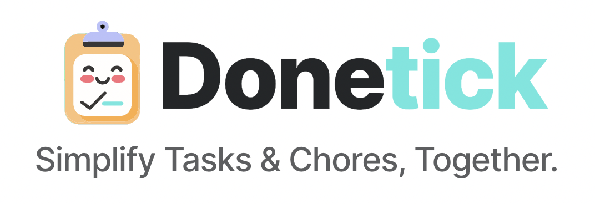

## Donetick Frontend

The Donetick Frontend is Frontend piece for Donetick written in javascript with React

## What is Donetick?

An open-source, user-friendly app for managing tasks and chores, featuring customizable options to help you and others stay organized.

## Why I made Donetick?

As an avid for open-source, I was eager to create a solution that could benefit the wider community. Donetick started as a personal project to address my own chore management needs, but it has evolved into bigger tool and decide to open source it for anyone seeking a customizable and privacy-focused task management tool

## Features

- Task and Chore Management: Easily create, edit, and manage tasks and chores for yourself or your group.
- Shared To-Do Lists: Create "Circles" to collaborate on tasks with family or your group
- Assignee Assignment: Assign tasks to specific individuals or rotate them automatically using customizable strategies.
- Recurring Tasks: Schedule tasks to repeat daily, weekly, monthly, or yearly, with flexible customization options.
- Progress Tracking: Track the completion status of tasks and view historical data.

## Installation

1. Clone the repository:
2. Navigate to the project directory: `cd frontend`
3. Download dependency `npm install`
4. Run locally `npm start`

## Contributing

Contributions are welcome! If you would like to contribute to Donetick, please follow these steps:

1. Fork the repository
2. Create a new branch: `git checkout -b feature/your-feature-name`
3. Make your changes and commit them: `git commit -m 'Add some feature'`
4. Push to the branch: `git push origin feature/your-feature-name`
5. Submit a pull request

## Need Help:

Donetick is a work in progress and has been a fantastic learning experience for me as I've honed my React skills,I'm looking for collaborators to help improve and refine the Donetick. Feel free to open PR or suggest changes.

## Plans :

My goal is to expand Donetick by offering a hosted infrastructure option. This will make it even easier for users to access and utilize Donetick's features without the need for self-hosting.

While maintaining Donetick's commitment to open source, this hosted option will provide a seamless, out-of-the-box experience for those who prefer a managed solution.

## License

This project is licensed under the AGPLv3 License. See the [LICENSE](LICENSE) file for more details. I might consider changing it later to something else
