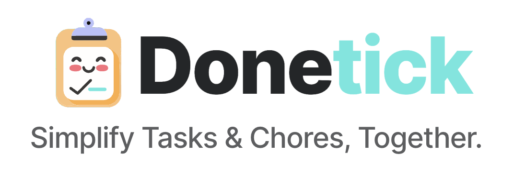

## Donetick 前端

Donetick 前端是使用 React 和 JavaScript 编写的 Donetick 项目的前端部分。

## 什么是 Donetick？

一个开源、用户友好的应用程序，用于管理任务和家务，具有可定制的选项，帮助您和他人保持井井有条。

## 我为什么创建 Donetick？

作为开源的狂热爱好者，我渴望创建一个能惠及更广泛社区的解决方案。Donetick 最初是一个个人项目，旨在解决我自己的家务管理需求，但后来演变成一个更大的工具，并决定将其开源，供任何寻求可定制和注重隐私的任务管理工具的人使用。

## 功能

- **任务和家务管理**：轻松为自己或团队创建、编辑和管理任务和家务。
- **共享待办事项列表**：创建“圈子”，与家人或团队协作完成任务。
- **任务分配**：将任务分配给特定个人，或使用可定制的策略自动轮换。
- **重复性任务**：安排任务按日、周、月或年重复，并提供灵活的定制选项。
- **进度跟踪**：跟踪任务的完成状态并查看历史数据。

## 安装

1. 克隆仓库：
2. 导航到项目目录：`cd frontend`
3. 下载依赖：`npm install`
4. 本地运行：`npm start`

## 贡献

欢迎贡献！如果您想为 Donetick 做贡献，请遵循以下步骤：

1. Fork 本仓库
2. 创建一个新分支：`git checkout -b feature/your-feature-name`
3. 做出更改并提交：`git commit -m 'Add some feature'`
4. 推送到分支：`git push origin feature/your-feature-name`
5. 提交一个拉取请求（Pull Request）

## 需要帮助：

Donetick 仍在开发中，它是我磨练 React 技能的一次绝佳学习经历。我正在寻找合作者来帮助改进和完善 Donetick。欢迎随时开启PR或提出建议。

## 计划：

我的目标是通过提供托管基础设施选项来扩展 Donetick。这将使用户更容易访问和利用 Donetick 的功能，而无需自行托管。

在保持 Donetick 对开源的承诺的同时，这个托管选项将为那些喜欢托管解决方案的用户提供无缝的、开箱即用的体验。

## 许可证

本项目采用 AGPLv3 许可证。更多详情请参阅 [LICENSE](LICENSE) 文件。我以后可能会考虑更换为其他许可证。
